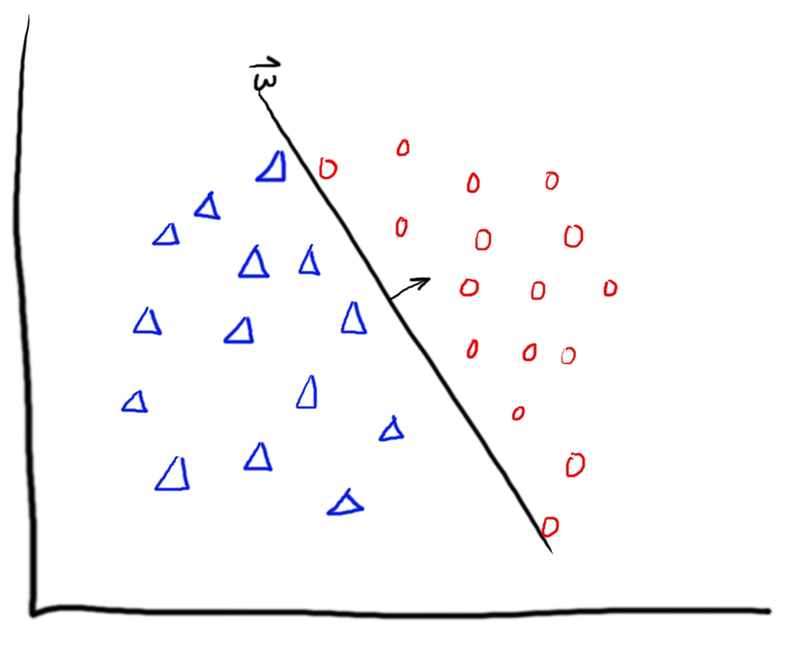

# Machine Learning Practice

The purpose of this repo is to practice implementing machine learning algorithms both from scratch, and with more efficient modules. I plan on really digging deep into the thoery, and implementing it in real-life data.

Below are the projects being worked on. These mirror projects assigned in the Cornell course ["Machine Learning for Intelligent Systems" (CS 4780/CS 5780)](http://www.cs.cornell.edu/courses/cs4780/2018fa/), except I alter the projects just a bit, and explore a bit deeper.

0. <a href="/euclidean_distance/euclidean_distance.ipynb">Euclidean Distance</a>

1. <a href="/knn/knn.ipynb">K-Nearest Neighbors</a>

2. <a href="/perceptron/perceptron.ipynb">Perceptron</a>

